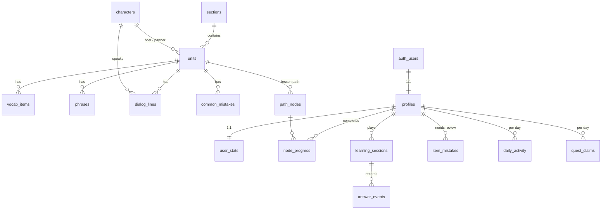

# Database design

Supabase (Postgres). Two groups of tables:

- **Content**: public, read-only for the app, filled from `seed.sql`.
- **Learner data**: each user can read only their own rows. The app never writes XP, gems, hearts or streaks directly; it calls functions that calculate them on the server, so nobody can award themselves points.

## Content tables

| Table | Key | Notes |
|---|---|---|
| `sections` | `s1` | CEFR level (A1, A2…), locked flag for "coming soon" sections |
| `units` | `u1` | Georgian host + English partner character, grammar note (JSON), tips |
| `vocab_items`, `phrases`, `dialog_lines`, `common_mistakes` | `u1.v1`, `u1.p1`, `u1.d1`, `u1.m1` | Stable IDs, so mistakes and analytics survive content edits. `audio_path` waits for recorded audio |
| `characters` | `nino`, `tom` | Name, bio, avatar look |
| `glossary` | Georgian word | English hint shown when the learner taps a word |
| `path_nodes` | `u1.n1` | Lesson / chest / review. `seq` is the global order used for unlocking |

## Learner tables

| Table | Purpose |
|---|---|
| `profiles` | Name, onboarding answers, daily goal, app colour, timezone (default Asia/Tbilisi). Only these settings are client-editable |
| `user_stats` | XP, gems, hearts (0–5), current and longest streak, last active day |
| `node_progress` | Which path nodes are done, best accuracy, replay count |
| `learning_sessions` | One row per finished lesson / review / practice |
| `answer_events` | One row per checked answer. Shows which phrases people find hardest |
| `item_mistakes` | Items answered wrong and not yet answered right. Feeds Practice > შეცდომების გამეორება |
| `daily_activity` | XP, sessions and perfect lessons per day, in the learner's timezone. Feeds the daily goal, quests, streak calendar and weekly league |
| `quest_claims` | Prevents the same daily quest from paying twice |

## Server functions (called with `supabase.rpc`)

| Function | Rules |
|---|---|
| `complete_session(kind, node_id, practice_mode, unit_ids, answers, started_at)` | Checks the node is unlocked and the learner has hearts. XP: lesson 10 (replay 5), review 20, practice 5, +5 for a perfect lesson. Updates streak, daily activity, mistakes, node progress, pays daily quests, practice restores 1 heart. Returns the new stats |
| `lose_heart()` | Wrong answer in a lesson |
| `refill_hearts()` | 50 gems, back to 5 hearts |
| `open_chest(node_id)` | +20 gems, once |
| `weekly_leaderboard(limit)` | Names and weekly XP only |
| `reset_my_progress()` | Profile > reset |
| `delete_my_account()` | Required by both app stores. Deletes the auth user; everything else cascades |

New users get a `profiles` and `user_stats` row automatically (trigger on `auth.users`), filled from the onboarding answers passed at sign-up.

## Tested behaviour

`npm run test:db` runs 32 checks against the real migration, including: skipping ahead is refused, chests open once, replays give 5 XP, the last wrong answer is remembered and a later correct one clears it, practice heals a heart, users cannot read each other's data or edit their own stats, signed-out users cannot call game functions, and deleting an account removes all its data.

## Later

- Timed heart refill (e.g. one heart every 4 hours) as a column + check in `complete_session`.
- Subscriptions: a `subscriptions` table updated by a RevenueCat or store webhook, checked in `lose_heart`.
- Friends leagues: a `league_groups` table; `weekly_leaderboard` filters by group.
